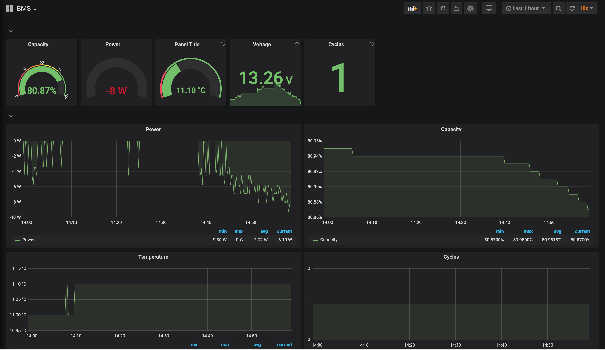

# bms-monitoring-stack

This stack deployes:
  * bms-db
  * bms-exporter
  * dht-exporter (DHT22 temp/humidity sensor)
  * prometheus
  * grafana


## Overview

This tool uses python gatt to scrape the information from Xiaoxiang BMS.
Those products are used for many LifePo4 based batteries.

I personally use it for a 2019 LIONTRON 200AH 12V LifePo4 caravan battery.
Those battery use BMS that use Bluetooth Low Energy with a non-standard protocol.o

I'm basically writing the values into a sqlite3 db that gets read by the bms-exporter.

Prometheus is configured to scrape the exporter.

Grafana setups a dashboard to visualize the data.

This runs on a Raspberry Pi 3b+ directly in the caravan.

## See also
  * heavily based on https://github.com/sw-home/FHEM-BluetoothSmartBMS
  * https://github.com/simat/BatteryMonitor/wiki/Generic-Chinese-Bluetooth-BMS-communication-protocol
  * https://mono.software/2018/11/15/multiple-bms-monitor/
  * http://www.deszynski.com/wp/xiaoxiang-bms-ios-app-ist-online/


This project is only for private usage. This has been done only in a few hours, so expect shortcuts and errors on the way. If you want to use it, change the MAC address in [docker-compose.yaml](docker-compose.yaml).

## Grafana Demo



## Known issues

Sometimes the bms-db hangs when not getting data, until this is fixed you can restart the container on stalled db entries:

```sh
cd bms-db; while sleep 5; do find . -name bms.db -mmin +1 | grep -q bms.db && (date; cd ..; docker-compose restart bms-db); done
```
